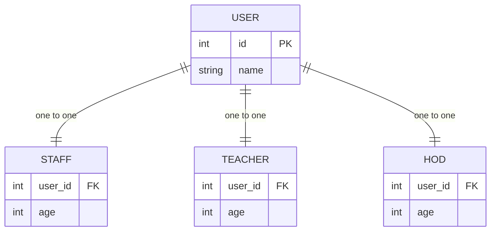
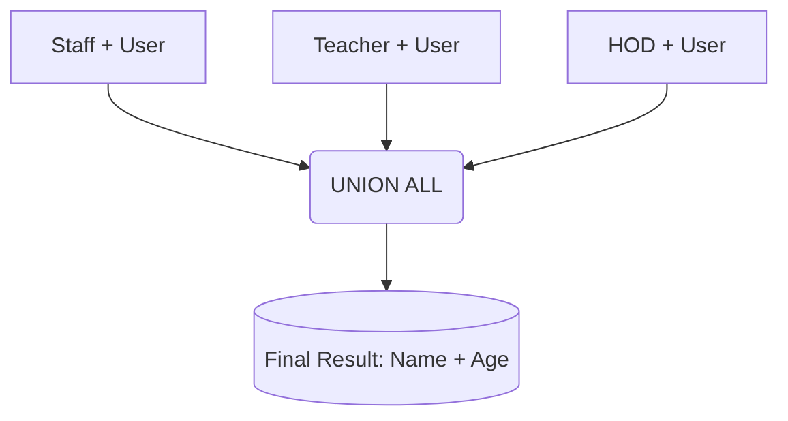

---
tags:
  - sql
---

# SQL Unions

### 1) `UNION`

Removes duplicate rows.  
Slower because it performs a DISTINCT operation.

### 2) `UNION ALL`

Keeps all rows, including duplicates.  
Faster because it does no deduplication.


**students_a**

|name|dept|
|---|---|
|Raman|CSE|
|Ajay|ECE|

**students_b**

|name|dept|
|---|---|
|Vivek|CSE|
|Ajay|ECE|
## Union


```sql
SELECT name, dept FROM students_a
UNION
SELECT name, dept FROM students_b;
```

|name|dept|
|---|---|
|Raman|CSE|
|Ajay|ECE|
|Vivek|CSE|


---

## Union All


```sql
SELECT name, dept FROM students_a
UNION ALL
SELECT name, dept FROM students_b;
```


| name  | dept |
| ----- | ---- |
| Raman | CSE  |
| Ajay  | ECE  |
| Vivek | CSE  |
| Ajay  | ECE  |


---
### Practice


Consider A, B , C has a one to one relation to D , and A, B, C almost does the same thing say A is staff , B is teacher , C is hod , and they all have one to one relation ship to D user , and user table has their name but it does not have their age , but A,B,C has it , and A,B,C also contains the forign key user_id , how can i print everyones Name and Age using a query. ? 

* * *


You want a **single list** of everyone (staff, teacher, HOD) with:

* Name → from `user`
* Age → from `A`, `B`, or `C`
* All three tables have a **one-to-one** relationship with `user`
* All three contain `user_id`
This is the exact use-case for **UNION ALL**.

* * *

# Final SQL Query

```sql
SELECT u.name, s.age
FROM staff s
JOIN user u ON u.id = s.user_id

UNION ALL

SELECT u.name, t.age
FROM teacher t
JOIN user u ON u.id = t.user_id

UNION ALL

SELECT u.name, h.age
FROM hod h
JOIN user u ON u.id = h.user_id;
```

* * *

### Why UNION ALL?

* You are combining rows from **three different role tables**.
* No need to remove duplicates because:
    * Each user belongs to **only one** of A/B/C (one-to-one).
* Faster and cleaner.
    

* * *

### Equivalent structure with CTE (if needed)

```sql
WITH all_people AS (
    SELECT u.name, s.age FROM staff s JOIN user u ON u.id = s.user_id
    UNION ALL
    SELECT u.name, t.age FROM teacher t JOIN user u ON u.id = t.user_id
    UNION ALL
    SELECT u.name, h.age FROM hod h JOIN user u ON u.id = h.user_id
)
SELECT * FROM all_people;
```

* * *

#### Output you get

| name | age |
| --- | --- |
| StaffName | 34 |
| TeacherA | 28 |
| HodX | 42 |

### 1) Mathematical Representation

#### Sets:

Let
* $A =$ Staff table
* $B =$ Teacher table
* $C =$ HOD table
* $D =$ User table

Each has a one-to-one relation:
$$A \leftrightarrow D,\quad B \leftrightarrow D,\quad C \leftrightarrow D$$
Meaning:

$$\forall a \in A,\ \exists !\, d \in D\ (a.user\_id = d.id)$$
==For all **a** belonging== to **A**, there ==exists exactly one **d**== in **D** such that **a.user_id = d.id***
$$\forall b \in B,\ \exists !\, d \in D\ (b.user\_id = d.id)$$ $$\forall c \in C,\ \exists !\, d \in D\ (c.user\_id = d.id)$$
>[!NOTE]- We say
>- ==For every element==($\forall a$) **a** in table **A**, there exists exactly one element **d** in table **D** such that the user_id of **a** equals the id of **d**.  
>- For every element **b** in table **B**, there exists exactly one element **d** in table **D** such that the user_id of **b** equals the id of **d**.  
>- For every element **c** in table **C**, there exists exactly one element **d** in table **D** such that the user_id of **c** equals the id of **d**.

Each person’s **Name** lives in $D$, and **Age** lives in the corresponding role table.

* * *

### Final result set:

You want:

$$R =  
\{(d.name, a.age)\ |\ a \in A,\ d \in D,\ a.user\_id = d.id \}  
\ \cup  
\{(d.name, b.age)\ |\ b \in B,\ d \in D,\ b.user\_id = d.id \}  
\ \cup  
\{(d.name, c.age)\ |\ c \in C,\ d \in D,\ c.user\_id = d.id \}$$

This corresponds exactly to:

$$R = R_A \cup R_B \cup R_C$$

Using SQL:

```sql
SELECT u.name, s.age FROM staff s JOIN user u ON u.id = s.user_id
UNION ALL
SELECT u.name, t.age FROM teacher t JOIN user u ON u.id = t.user_id
UNION ALL
SELECT u.name, h.age FROM hod h JOIN user u ON u.id = h.user_id;
```

* * *

# 2) Mermaid Diagram

## Entity-Relation Diagram



* * *

## Query Flow (UNION logic)


